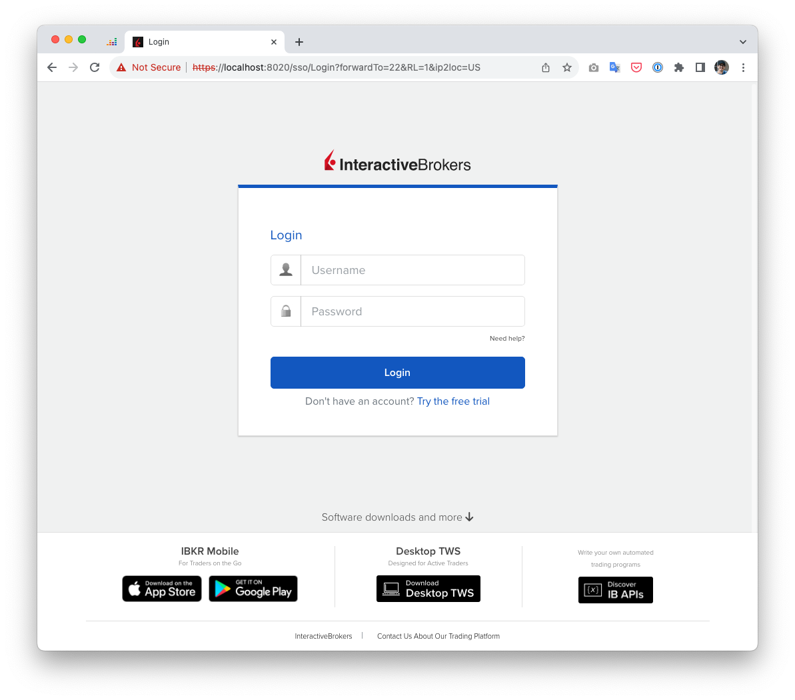
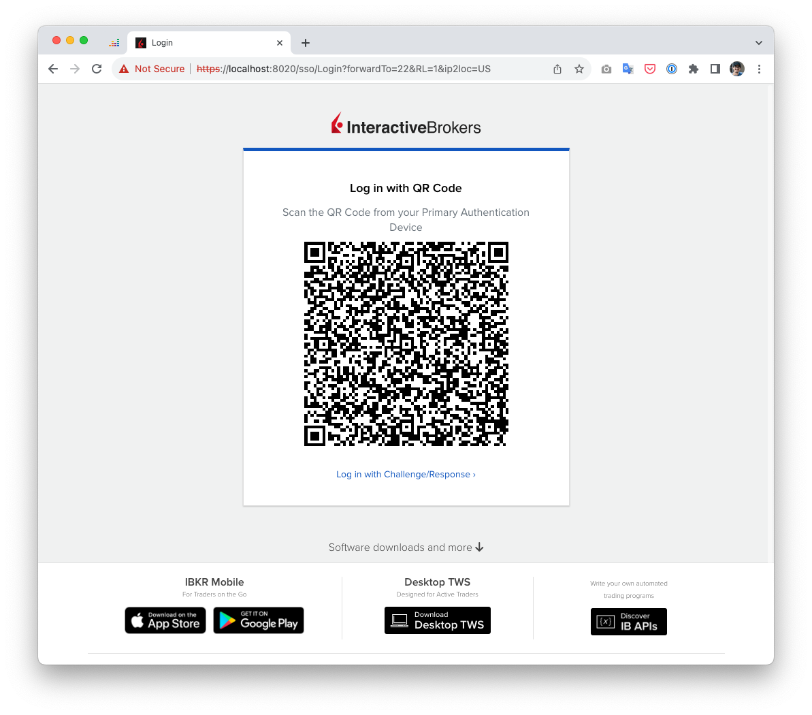
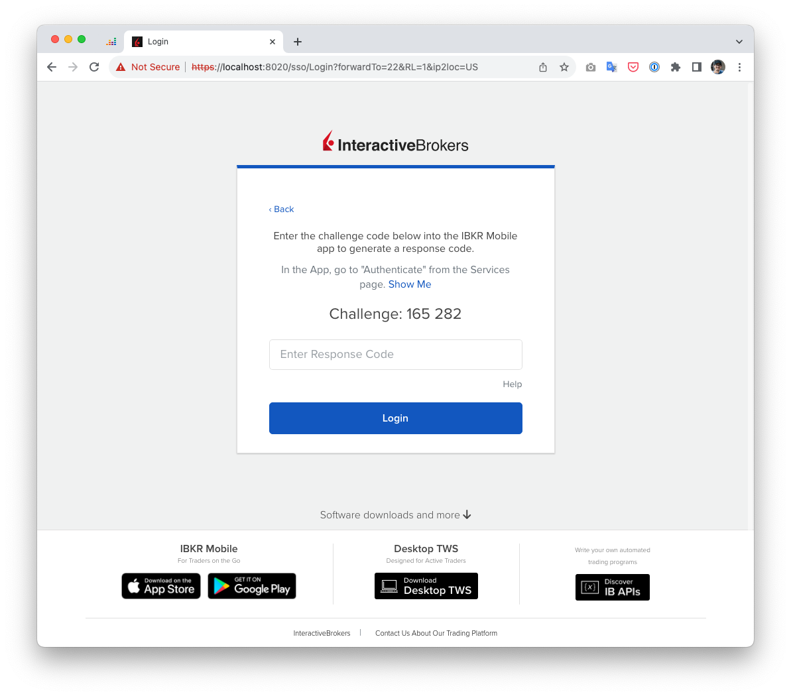
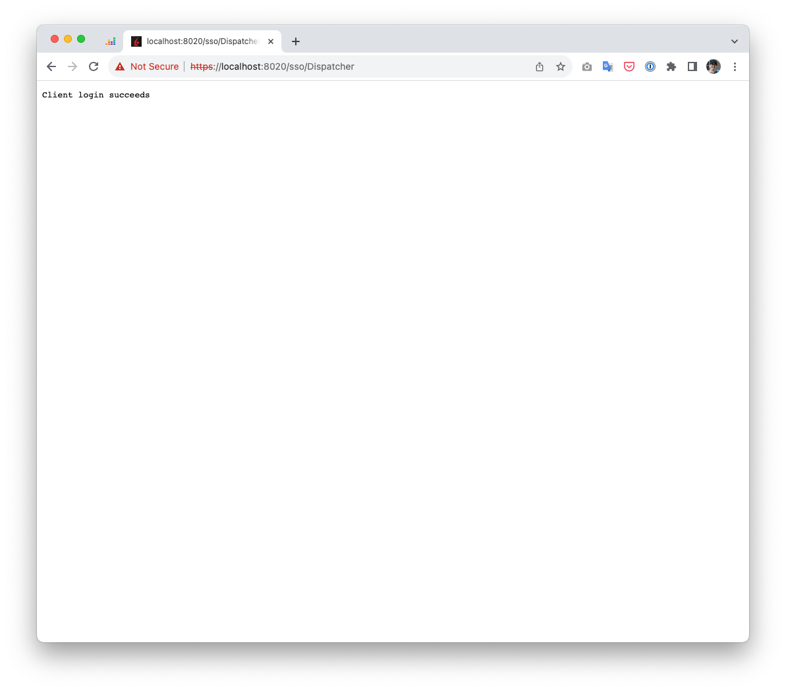

# IBKR API Gateway

IBKR API Gateway is a docker image that runs the Interactive Brokers API Gateway. It uses the latest version of the
gateway available on the IBKR website starting from a27ed42161ad96c53e715ca5c5e3e3fa4cff5262 version.

## Usage

Run the gateway with the following command:
```bash
docker run -d -P ghcr.io/gabrielbussolo/ibkr-api-gateway:latest
```
> The default port is `5000`

Access https://localhost:5000 and login with your IBKR account.


Proceed with the 2FA authentication by QRCode

or by security code


after the authentication is complete you will see the following screen


And you are ready to use the IBKR API through the gateway!

> NOTE: The gateway uses an expired certificated provided by IBKR. You can use the `-k` option in curl to ignore the certificate on curl requests.

Example:
Verify auth status:
```bash
curl -k 'https://localhost:5000/v1/api/iserver/auth/status'  
{
  "authenticated": true,
  "competing": false,
  "connected": true,
  "message": "",
  "MAC": "**:**:**:**:**:**",
  "serverInfo": {
    "serverName": "JifZ01036",
    "serverVersion": "Build 10.25.0b, Sep 14, 2023 5:44:17 PM"
  },
  "fail": ""
}
```

Search for a contract:
```bash
curl -ilk https://localhost:8020/v1/api/trsrv/stocks\?\symbols=META
HTTP/1.1 200 OK
Referrer-Policy: Origin-when-cross-origin
x-response-time: 17ms
Content-Type: application/json;charset=utf-8
X-Content-Type-Options: nosniff
Expires: Fri, 22 Sep 2023 10:17:37 GMT
Cache-Control: max-age=0, no-cache, no-store
Pragma: no-cache
Date: Fri, 22 Sep 2023 10:17:37 GMT
Connection: keep-alive
Set-Cookie: x-sess-uuid=0.34467b5c.1695377857.47099b9d; secure; HttpOnly
Server-Timing: cdn-cache; desc=MISS
Server-Timing: edge; dur=4
Server-Timing: origin; dur=37
Vary: origin
Server-Timing: ak_p; desc="1695377857555_1551582772_1191811997_4106_7896_44_0_-";dur=1
Transfer-Encoding: chunked

{
  "META": [
    {
      "name": "META PLATFORMS INC-CLASS A",
      "chineseName": "Meta&#x5E73;&#x53F0;&#x80A1;&#x4EFD;&#x6709;&#x9650;&#x516C;&#x53F8;",
      "assetClass": "STK",
      "contracts": [
        {
          "conid": 107113386,
          "exchange": "NASDAQ",
          "isUS": true
        },
        {
          "conid": 114922621,
          "exchange": "MEXI",
          "isUS": false
        }
      ]
    },
    ...
  ]
}
```

## Configuration
The container run with the default config provided by IBKR. If you want to customize the configuration you can mount a
volume with your own configuration file. The default configuration file is located at `/root/config.yaml`.

```bash
docker run -d -v /path/to/your/config.yaml:/home/ibkr/root/config.yaml ghcr.io/gabrielbussolo/ibkr-api-gateway:latest
```

Example of a configuration file:
```yaml
ip2loc: "US"
proxyRemoteSsl: true
proxyRemoteHost: "https://api.ibkr.com"
listenPort: 5000
listenSsl: true
ccp: false
svcEnvironment: "v1"
sslCert: "vertx.jks"
sslPwd: "mywebapi"
authDelay: 3000
portalBaseURL: ""
serverOptions:
  blockedThreadCheckInterval: 1000000
  eventLoopPoolSize: 20
  workerPoolSize: 20
  maxWorkerExecuteTime: 100
  internalBlockingPoolSize: 20
cors:
  origin.allowed: "*"
  allowCredentials: false
ips:
  allow:
    - 192.*
    - 131.216.*
    - 127.0.0.1
  deny:
    - 212.90.324.10
```